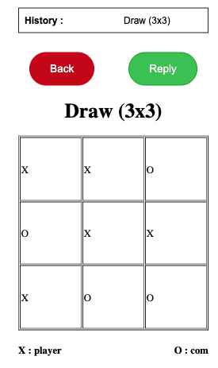

##  XO game 
-------------------

### การออกแบบโปรแกรม 
> การออกแบบเมื่อผู้เล่นเริ่มเกมส์ โปรแกรมจะเก็บวิธีชนะทั้งหมดเอาไว้ใน array แล้วใช้ algorithm minimax ในการหาจุดที่ชนะและกันผู้เลยจะชนะ ถ้าไม่มีจุดชนะหรือจุดที่ผู้เลยชนะ ก็จะหาจุดที่ดีที่สุดต่อไป จาก array ที่เก็บวิธีชนะ โดยแอปนี้ ใช้ sqlite เป็นฐานข้อมูล ชือ game.db ทำหน้าที่เก็บข้อมูลที่เคยเล่น ใช้ golang เป็น api service เพื่อ getและsave ข้อมูลลงฐานข้อมูล และ html + javascript เป็น frontend  รายละเอียดในออกแบบ มีดังนี้ 

1. การออกแบบ database  
มี 1 ตารางในการเก็บ  game history
    
    **game_history table**

    | Name        | type       | description |
    | ----------- | ---------- | ----------- |
    | game_id     | integer    | primary key |
    | board_size  | integer    | เก็บขนานของตาราง |
    | winner      | integer    | ใครชนะหรือเสมอ |
    | all_turn    | text       | เก็บทุก turn ที่เล่น format positon:who , .... , postion:who |

2. api service

    มี 2 api คือ

        1. gethistory ใช้สำหรับในการ request ของ history game 
        2. savehistory ใช้สำหรับในการ เก็บข้อมูลในการเล่น

3. frontend 
    
    แอปนี้จะมี 3 หน้าคือ

        3.1 หน้าแรก

    

    หน้าแรกของเกมส์จะมีเมนู play กับ history โดย play จะเป็นการเข้าไปเล่นเกมส์และหน้า history เป็นการดูประวัติการเล่นเกมส์

        3.2 หน้าสำหรับเล่นเกมส์

    

    หน้าเล่นเกมส์ เริ่มต้นจะต้องเลือกขนานของ board ก่อน โดยขนาด board ดังนี้ 3x3 , 4x4 และ 5x5

    

    การเล่นเกมส์ให้คลิกไปช่องว่างของ board โดยผู้เล่นจะเป็น x และ com จะเป็น o 

        3.3 หน้าสำหรับดูเกมส์ที่เล่นไปแล้ว 

    

    หน้าดูประวัติการเล่น จะมีปุ่ม back เพิ่มกลับ history ไว้เลือกดูว่าจะดูเกมส์ที่เคยเล่นไป และปุ่ม reply ให้แสดงการเล่นซ้ำอีกครั้ง 

    

-----

### การติดตั้งโปรแกรมและใช้งาน 

    1. ติดตั้งและรันโปรแกรมผ่าน docker 

        ใช้ command line หรือ terminal เข้ามาในโปรเจกต์ tic-tac-toe แล้ว พิมพิ์คำสั่ง docker-compose up 
    
    2. ติดตั้งและรันโปรแกรมผ่านคอมพิวเตอร์

        2.1 frontend 

            - ต้องนำ files ทั้งหมด ในโปรเจกต์ ที่ path : frontend/src ไปว่างที่ web server แล้วเข้าผ่าน web browser ชี้ url ที่ web server นั้น 

        2.2 api service 

            - ใช้ command line หรือ terminal เข้ามาที่โปรเจกต์ แล้ว cd ไปที่ api 
            - ใช้คำสั่ง go build -o main 
            - จากนั้น รัน ไฟล์ชื่อ main

